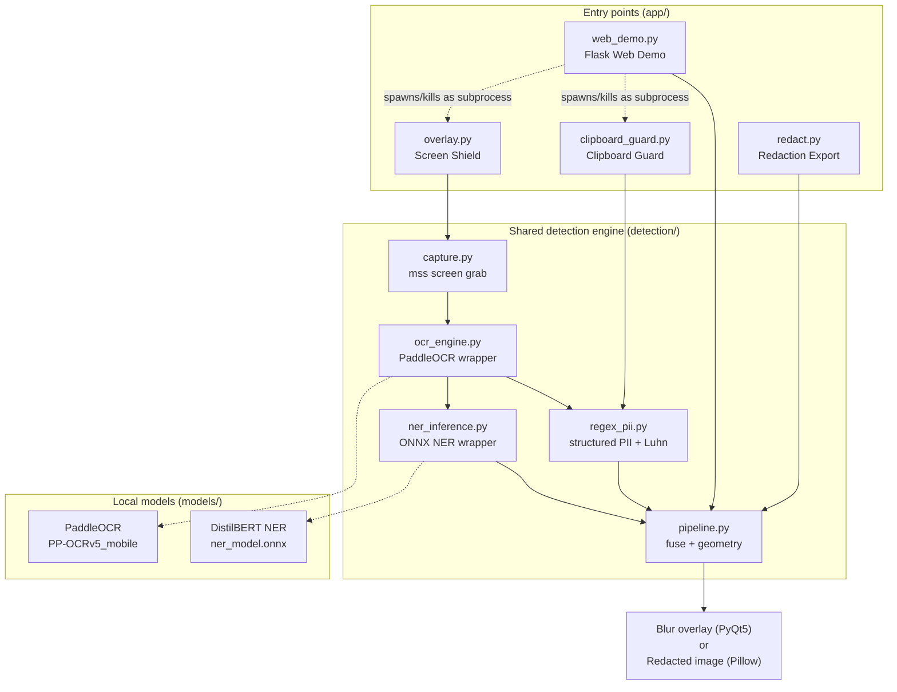

# PrivyShield: Architecture

This document covers the system diagram, the model pipeline, data flow, the local/cloud split, and the key design decisions behind PrivyShield.

---

## 1. System diagram

PrivyShield has four entry points (Screen Shield, Redaction Export, Clipboard Guard, Web Demo). All four sit on top of the same shared detection pipeline, so there is exactly one place where "what counts as sensitive" is decided.



Everything inside the dashed box below runs on the user's machine. Nothing crosses it.

```
┌─────────────────────────── user's machine ───────────────────────────┐
│                                                                        │
│   screen / clipboard / uploaded file                                  │
│           │                                                           │
│           ▼                                                           │
│   detection pipeline (OCR + regex + NER, all local inference)         │
│           │                                                           │
│           ▼                                                           │
│   blur overlay / redacted file / clipboard warning / web page         │
│                                                                        │
└────────────────────────────────────────────────────────────────────────┘
```

---

## 2. Model pipeline

Two models, chained, both doing local inference:

| Stage | Model | Type | Role |
|---|---|---|---|
| Text extraction | PaddleOCR (`PP-OCRv5_mobile`) | Pretrained, downloaded once and cached | Turns screen pixels into text lines + bounding boxes + confidence |
| Structured PII | Python `re` + Luhn algorithm | Not a model, rule-based | Catches Aadhaar, PAN, credit cards, emails, phone numbers, OTP-like codes, since these have fixed formats |
| Unstructured PII | Fine-tuned `distilbert-base-uncased` → ONNX | Custom, trained for this project | Token classification (NER) for `PERSON_NAME` and `ADDRESS`, which have no fixed shape |

Why two different detection strategies instead of one model for everything: fixed-format PII is faster and more reliable to catch with pattern matching than with a model, so the NER model is only asked to do the part regex genuinely cannot, free-form names and addresses. This keeps the model small, keeps inference fast (~14-15ms per line on CPU), and keeps the regex side deterministic and easy to audit.

NER training pipeline (offline, not run at inference time):

```
dataset_generator.py                    train.py
  (7,500 synthetic, auto-labeled)  -->  fine-tune distilbert-base-uncased
                                    -->  evaluate (seqeval, entity-level F1)
                                    -->  export to ONNX
                                    -->  ner_model.onnx  (hosted on Hugging Face)
```

The generator auto-labels entity spans as it builds each sentence, so no manual annotation step exists in this pipeline.

---

## 3. Data flow

### Screen Shield (live overlay)

```
mss capture --> PaddleOCR --> [regex_pii, ner_inference] --> pipeline.fuse
     --> flagged bounding boxes --> Gaussian blur drawn on transparent,
         click-through, always-on-top PyQt5 window
```

This loop repeats continuously. It never sleeps longer than needed, but it also can't refresh faster than one full detection pass takes, so refresh rate scales with how much text is on screen (roughly 3-4 seconds for a busy IDE + terminal + browser, faster for lighter screens).

### Redaction Export

```
image/PDF file --> PaddleOCR --> [regex_pii, ner_inference] --> pipeline.fuse
     --> flagged bounding boxes --> Pillow blacks out regions --> redacted file
```

Same pipeline as Screen Shield, just run once against a static file instead of a continuous capture loop.

### Clipboard Guard

```
pyperclip detects new clipboard content --> regex_pii (+ ner_inference)
     --> local notification if flagged, nothing blocked, just a warning
```

### Web Demo

```
browser (localhost only)
     │
     ├── upload image  --> redact.py --> same pipeline as Redaction Export
     │                                    --> before/after shown in-page (base64, no disk write)
     │
     └── toggle buttons --> subprocess.Popen("python -m app.overlay" / "python -m app.clipboard_guard")
                              --> start/stop the actual overlay or clipboard guard process
```

The Flask server here is purely a local control surface: it reuses the exact same `redact.py` pipeline for uploads, and it starts/stops the other two entry points as subprocesses rather than reimplementing them.

---

## 4. Local vs. cloud components

**Everything is local. There is no cloud component.**

| Component | Where it runs | Network use |
|---|---|---|
| Screen/clipboard/file capture | Local | None |
| PaddleOCR inference | Local | None at runtime |
| Regex + Luhn detection | Local | None |
| NER (ONNX) inference | Local | None at runtime |
| Blur overlay / redaction | Local | None |
| Web demo | Local (`127.0.0.1:5000`) | None, not exposed beyond localhost |

The only two moments that touch the network at all, and both are one-time setup, not part of the runtime pipeline:

1. **First run of PaddleOCR**: downloads its detection/recognition model weights once, then caches them locally. Every run after that is fully offline.
2. **Fetching the NER model weights**: `ner_model.onnx` is hosted on Hugging Face because it's a binary file not committed to the repo, so it's pulled down once via `hf_hub_download` before first use.

After these two downloads, PrivyShield has no dependency on any external server to function.

---

## 5. Key design decisions

- **Regex for structured PII, a trained model only for unstructured PII.** Fixed-format data (Aadhaar, PAN, cards, emails, phone numbers, OTPs) doesn't need a model; pattern matching is faster and just as reliable, and it's easy to reason about and extend. A model is reserved for names and addresses, the one part of the problem that genuinely has no fixed shape.
- **Luhn validation on top of the credit card regex**, specifically to cut down false positives on numbers that merely look like a card number.
- **ONNX export for the NER model**, so inference doesn't require PyTorch or a GPU at runtime, only `onnxruntime`, which keeps the "running the app" environment light.
- **Synthetic, auto-labeled training data** instead of manual annotation, since the entity spans are known at generation time. This made 7,500 labeled examples feasible to produce without a manual labeling pass, at the cost of the model being somewhat less robust to real-world OCR noise than to the clean synthetic test set.
- **Lightweight OCR variant (`PP-OCRv5_mobile`) over the larger `medium` models**, prioritizing refresh speed for a continuously-running live overlay over marginal accuracy gains, since the overlay's usefulness depends on catching PII before it's seen, not after.
- **Document-photo preprocessing (orientation classification, unwarping) disabled** in PaddleOCR, since a screen capture is already flat and upright; this preprocessing is built for photographed documents, not screenshots, and would only add latency here.
- **Confidence thresholding on NER predictions**, so the model drops flags it isn't confident about rather than over-flagging.
- **Two separate virtual environments** (`venv-app` and `venv-train`), not one. `torch` and `paddlepaddle-gpu` both pull in `nvidia-cudnn-cu12` but expect different versions, causing a DLL conflict on Windows. Since the running app only needs `onnxruntime` and never needs PyTorch at all, splitting the training environment out entirely avoids the conflict rather than trying to pin around it.
- **Clipboard Guard warns rather than blocks.** It's a local notification, not a paste-blocking mechanism, so it stays out of the user's way rather than interrupting their workflow on a false positive.
- **The web demo reuses the existing pipeline and entry points rather than reimplementing them.** Uploads go through the same `redact.py` used by the CLI redaction tool, and the overlay/clipboard guard toggles just start and stop the existing `app.overlay` / `app.clipboard_guard` processes as subprocesses. This keeps a single source of truth for detection logic and process behavior.
- **No content is ever logged or persisted.** The overlay only draws a blur, the redaction tool only writes the redacted output the user asked for, and the web demo's before/after images are held in memory and rendered as base64, never written to disk. This was a deliberate constraint given the roadmap Risk Dashboard (Layer 5) will only ever log PII *categories and counts*, never content, for the same reason.

---

Built by [Aditya](https://github.com/aditrynacode) for OSDHack 2026 🚀